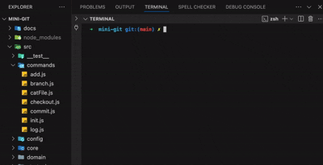

# 🐙 mini-git

> Git의 내부 구조를 직접 구현해보는 CLI 기반 학습 프로젝트입니다.

Git의 내부 동작 원리를 학습하며 구현한 Git 클론 프로젝트입니다.  
Git 객체(`blob`, `tree`, `commit`) 생성과 참조 과정을 직접 구현해보며 구조를 체화했습니다.

# 시연 데모



```plaintext
Working Dir → add() → Blob (해시)
              ↓
          Index (스테이징)
              ↓
        commit() → Tree → Commit
                        ↑
               HEAD → Branch (refs/heads/main)
```

## 구현 기능

| 명령어     | 설명                                          |
| ---------- | --------------------------------------------- |
| `init`     | 저장소 초기화                                 |
| `add`      | 파일을 `Blob` 객체로 저장 후 `index` 기록     |
| `commit`   | `Tree`, `Commit` 객체 생성 및 `HEAD` 업데이트 |
| `branch`   | 새로운 브랜치 생성                            |
| `checkout` | 브랜치 전환                                   |
| `log`      | 커밋 로그 출력                                |

## 설치 및 사용

```bash
npm install

# 일반 실행
node src/index.js init
node src/index.js add hello.txt
node src/index.js commit "first commit"

# 또는 CLI 명령어로 등록 (1회 실행)
npm link

# 이후부터
mini-git init
mini-git add hello.txt
mini-git commit "first commit"

```

## 디렉토리 구조

```bash
src
├── index.js                # CLI 진입점 (전략 패턴으로 명령어 분기)
├── commands/               # 각 명령어 실행 함수
├── core/                   # Git 내부 로직 (객체 생성, 해시 처리 등)
├── strategies/             # 명령어 분기 로직 (전략 패턴)
├── config/                 # 사용자 정보 및 환경 설정
├── utils/                  # 공통 유틸 함수
├── domain/                 # 메시지, 상수, Enum 정의
└── __test__/               # Jest 테스트 코드
```

## 기술 스택

| 기술                     | 사용 목적 및 역할                        |
| ------------------------ | ---------------------------------------- |
| **Node.js**              | CLI 기반 명령어 실행 환경                |
| **Jest**                 | 커맨드별 단위 테스트 수행                |
| **SHA-1 해시 구현**      | Git 객체 간 참조를 위한 고유 식별자 생성 |
| **파일 시스템 스토리지** | `.mini-git` 디렉토리에 Git 객체 저장     |
| **JSDoc**                | 함수 및 모듈 문서 자동 생성 도구         |

> 복잡한 유틸 함수의 JSDoc 기반 자동 문서는 [여기서 확인](https://mindaaaa.github.io/mini-git/global.html)할 수 있습니다.

🔍 더 깊은 내용이 궁금하다면?<br>
아래 문서에서 구조, 설계, 동작 흐름을 더 깊이 있게 확인할 수 있습니다.

| 문서명                                                                                                                   | 설명                                                                                                                                    |
| ------------------------------------------------------------------------------------------------------------------------ | --------------------------------------------------------------------------------------------------------------------------------------- |
| [`mini-git-summary.md`](https://github.com/mindaaaa/Dev-Journey/blob/main/CS/mini-git/mini-git-summary.md)               | 프로젝트 개요, 기능 구성, 구현 흐름, 전체 구조 요약 등<br>**전반적인 설명과 개요**를 담은 메인 문서                                     |
| [`git-internals.md`](https://github.com/mindaaaa/Dev-Journey/blob/main/CS/mini-git/git-internals.md)                     | Git의 내부 저장 구조와 핵심 객체 (`blob`, `tree`, `commit`), `HEAD`, `index`, `refs` 등<br>**구성 원리와 작동 방식**을 정리한 핵심 문서 |
| [`git-design-notes.md`](https://github.com/mindaaaa/Dev-Journey/blob/main/CS/mini-git/git-design-notes.md)               | mini-git의 설계 기준, 단순화 이유, 디렉토리 구조 및 전략 패턴 등<br>**설계 기반 회고와 고민을 담은 문서**                               |
| [`git-behavior-comparison.md`](https://github.com/mindaaaa/Dev-Journey/blob/main/CS/mini-git/git-behavior-comparison.md) | Git과 mini-git이 명령어 실행 시<br>**어떻게 다르게 저장하고 참조하는지를 시각적으로 비교**한 실험 기반 문서                             |
| [`README.md`](https://github.com/mindaaaa/mini-git/blob/main/README.md)                                                  | 실제 명령어 사용법, CLI 구조, 옵션 설명 등<br>mini-git 프로젝트의 **사용 매뉴얼** 역할을 하는 문서                                      |
