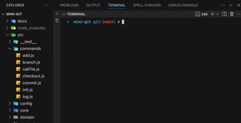

<div align="center">


<h1>
  
</h1>

<p>
  <b>Git이 파일을 어떻게 저장하고, 어떻게 기억하는가.</b>
  <br />
  <sub>blob · tree · commit 객체를 직접 만들고 참조하며<br />
  Git의 내부 구조를 체화한 CLI 학습 프로젝트</sub>
</p>

<br />

<p>
  <a href="#-시연-데모"></a>
  <a href="#-설치-및-사용"></a>
  <a href="#-더-깊이-읽기"></a>
</p>

<br />

<table align="center">
  <tr>
    <td align="center"><b>6</b><br/><sub>구현 명령어</sub></td>
    <td align="center"><b>3</b><br/><sub>핵심 객체</sub></td>
    <td align="center"><b>SHA-1</b><br/><sub>해시 활용</sub></td>
    <td align="center"><b>0</b><br/><sub>외부 git 의존</sub></td>
  </tr>
</table>

</div>

<br />

---

## 📺 시연 데모

<div align="center">

### CLI 동작



<sub>Git 객체가 실제로 생성되고 참조되는 과정을 확인할 수 있습니다.</sub>

</div>

<br />

> [!TIP]
> 전체 흐름은 아래와 같이 이어집니다.

```plaintext
Working Dir → add() → Blob (해시)
              ↓
          Index (스테이징)
              ↓
        commit() → Tree → Commit
                        ↑
               HEAD → Branch (refs/heads/main)
```

<br />

---

## ⚙️ 구현 기능

<div align="center">

<table>
<tr>
<td width="50%" valign="top">

### 저장소 관리

| 명령어   | 설명                             |
| -------- | -------------------------------- |
| `init`   | `.mini-git` 저장소 초기화        |
| `add`    | 파일을 Blob으로 저장 · index 기록 |
| `commit` | Tree · Commit 생성 · HEAD 갱신   |

</td>
<td width="50%" valign="top">

### 히스토리 · 브랜치

| 명령어     | 설명                  |
| ---------- | --------------------- |
| `branch`   | 새 브랜치 생성        |
| `checkout` | 브랜치 전환           |
| `log`      | 커밋 히스토리 출력    |

</td>
</tr>
<tr>
<td width="50%" valign="top">

### SHA-1 기반 객체 저장

모든 객체는 해시로 식별되어 `.mini-git/objects/` 에 저장됩니다.  
동일한 내용은 동일한 해시로 중복 없이 참조됩니다.

</td>
<td width="50%" valign="top">

### 전략 패턴 CLI

`index.js` 진입점에서 명령어별 전략 객체로 분기해 실행합니다.  
새 명령어를 추가해도 진입점은 변하지 않습니다.

</td>
</tr>
</table>

</div>

<br />

---

## 🛠️ 기술 스택

<div align="center">

### Core


### Testing & Docs


### Under the Hood


</div>

> [!NOTE]
> 복잡한 유틸 함수의 JSDoc 기반 자동 문서는 [여기서 확인](https://mindaaaa.github.io/mini-git/global.html)할 수 있습니다.

<br />

---

## 🚀 설치 및 사용

### ① 설치

```bash
npm install
```

### ② 일반 실행

```bash
node src/index.js init
node src/index.js add hello.txt
node src/index.js commit "first commit"
```

### ③ CLI 명령어로 등록 (선택)

```bash
npm link
```

이후부터는 다음과 같이 사용할 수 있습니다.

```bash
mini-git init
mini-git add hello.txt
mini-git commit "first commit"
```

<br />

---

## 📂 디렉터리 구조

```bash
src
├── index.js         # CLI 진입점 (전략 패턴으로 명령어 분기)
├── commands/        # 각 명령어 실행 함수
├── core/            # Git 내부 로직 (객체 생성, 해시 처리 등)
├── strategies/      # 명령어 분기 로직 (전략 패턴)
├── config/          # 사용자 정보 및 환경 설정
├── utils/           # 공통 유틸 함수
├── domain/          # 메시지, 상수, Enum 정의
└── __test__/        # Jest 테스트 코드
```

<br />

---

## 🔗 더 깊이 읽기

> [!TIP]
> 구조 · 설계 · 동작 흐름을 더 깊이 알고 싶다면 아래 문서를 확인하세요.

<div align="center">

<table>
<tr>
<td width="50%" valign="top">

### [mini-git-summary.md](https://github.com/mindaaaa/Dev-Journey/blob/main/CS/mini-git/mini-git-summary.md)

프로젝트 개요 · 기능 구성 · 구현 흐름 · 전체 구조 요약.
<br /><sub>**전반적인 설명과 개요**를 담은 메인 문서</sub>

</td>
<td width="50%" valign="top">

### [git-internals.md](https://github.com/mindaaaa/Dev-Journey/blob/main/CS/mini-git/git-internals.md)

blob · tree · commit · HEAD · index · refs 등.
<br /><sub>**구성 원리와 작동 방식**을 정리한 핵심 문서</sub>

</td>
</tr>
<tr>
<td width="50%" valign="top">

### [git-design-notes.md](https://github.com/mindaaaa/Dev-Journey/blob/main/CS/mini-git/git-design-notes.md)

설계 기준 · 단순화 이유 · 디렉터리 구조 · 전략 패턴.
<br /><sub>**설계 기반 회고와 고민을 담은 문서**</sub>

</td>
<td width="50%" valign="top">

### [git-behavior-comparison.md](https://github.com/mindaaaa/Dev-Journey/blob/main/CS/mini-git/git-behavior-comparison.md)

Git과 mini-git의 저장 · 참조 차이를 시각적으로 비교.
<br /><sub>**실험 기반 비교 문서**</sub>

</td>
</tr>
</table>

</div>

<br />

---

<div align="center">

<sub>
  Git을 쓰는 것과, Git을 이해하는 것은 다르다.
  <br />
  <b>— blob 하나부터 직접 만들어 본 기록. —</b>
</sub>

</div>
